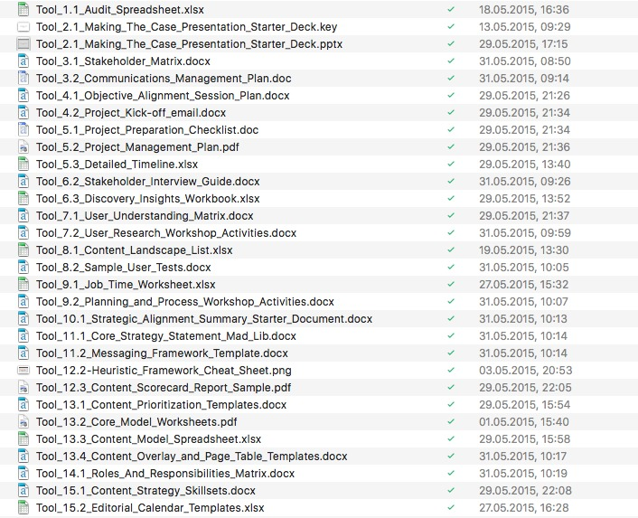
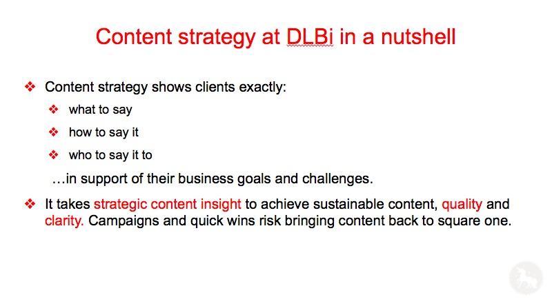

#

„Content strategy plans for the creation, delivery and governance of useful, usable content.“

# Content strategy as a discipline

- Development since the 1990ies
- Mostly in the US and the anglosphere
- In digital agencies and large companies
- Roots in editorial, user experience design, web development and marketing
- Base for content marketing
- Professionalization in Europe since the 2010s

# Goals today:

- Describe content strategy as a discipline
- Discuss the originality of content strategy

# Why do we need content strategy?

Content strategy makes sure that ...
… content fulfills user needs
… content fulfills the needs of organizations

# Publishing without content strategy is like publishing without planning

#

#

- Content is an asset:
- To produce contet is painful, expensive and complicated
- Content has to be maintained and must evolve
- Content can and should be reused

::: notes

Content- Artefakte mit einer Botschaft oder einen kommunikativen GehaltCS Planung dieser Artefakte in Bezug auf ihren Kommunikativen Gehalt

Eine Content-Strategie unterscheidet sich von einer Kommunikationsstrategie dadurch, dass sie sich vor allem mit den Artefakten beschäftigt, die on erster Linie existieren, um eilne kommunikative Botschaft vermitteln. Die Content-Strategie konzentriert sich auf die Artefakte und auf die besonderen Regeln die für diese Artefakte gelten. Sie tut dies aber nicht um diese Artefakte technisch zu produzieren sondern sie tut es mit dem Ziel dass die Artefakte die gewünschte Botschaft tatsächlich vermitteln Punkt auch in diesem Bereich ist die Content-Strategie mit der Architektur gut vergleichbar auch in der Architektur geht es nicht so einfach darum, Gebäude zu realisieren, die technisch funktionieren, also ihre Funktionen erfüllen, sondern darum, dass die Gebäude den Wünschen ihrer Benutzer und Auftraggeber optimal entsprechen.

Vom Konzept des Artefakts ausgehen kann man auch die Frage beantworten, ob ein Unterschied zwischen Content-Strategie überhaupt und digitaler Content-Strategie besteht. Content-Strategie braucht man für Inhalte, also Artefakte jeder Art Punkt alte bieten aber viel mehr Möglichkeiten, und die Artefakte zu denen sie gehören, sind wirklich komplexer als die Inhalte, die vor der digitalen Revolution gehabt, und die mit relativ überschaubaren Techniken produziert worden. Vor allem lassen sich digitale Inhalte leicht mit Ana ineinander überführen, sodass überhaupt erst Inhalte als solche ins Blickfeld geraten während man sich vorher eigentlich direkt mit den Artefakten Beschäftigte, also zB Büchern, an die diese Inhalte gebunden waren
:::

# Planning for the life cycle of content

#

Quelle: [Enterprise-Content-Management-in-SharePoint-Server](https://support.office.com/en-us/article/Introduction-to-Enterprise-Content-Management-in-SharePoint-Server-2007-67c13ac8-f6ef-4752-8976-d2910e1da6b4)

# Content-Strategie:

> repeatable system which governs the management of content throughout the whole lifecycle of content

(Rahel Bailie, [Content Strategy Framework for the Content Lifecycle](https://de.slideshare.net/rahelab/content-strategy-framework-for-the-content-lifecycle "Content Strategy Framework for the Content Lifecycle"))

#

> Content strategy is to copywriting as information architecture is to design
(Rahel Lovinger)

Rahel Lovinger, [Content Strategy: The Philosophy of Data](http://boxesandarrows.com/content-strategy-the-philosophy-of-data/ "Content Strategy: The Philosophy of Data - Boxes and Arrows")

# Risks of not planned content

- Lack of consistency
- Difficulty of reuse
- Misjudging the potential of content
- Lack of appropriateness to user needs
- Poor planning and use of resources
...

# What's a content strategist to do?

> ... a content strategist, working with, interfaces, systems, people, and the connections—and especially the disconnections—between them.”

::: notes

Wie Architekten müssen content Strategen mit einer großen Zahl ganz unterschiedliche Dinge Personen und Gegebenheiten arbeiten, um ein Ergebnis, nämlich Qualität von Inhalten, zu erreichen. Man kann sie nicht auf einem dieser verschiedenen Bereiche festlegen, auch wenn bei vielen Projekten der Hauptakzent auf einem dieser Bereiche liegt. Content hat mit der Verbindung sehr unterschiedliche Dinge zu tun, und diese Verbindungen sind das Hauptthema in der Arbeit von contact Strategen. Dieses Zitat von Jonathan Colman drückt diesem Zusammenhang, wie ich finde, sehr gut aus. Es zeigt auch dass das Hauptproblem bei der Arbeit vom content Strategen in fehlenden Verbindungen liegt, also  darin, Verbindungen herzustellen die notwendig sind. Da im Einzelfall in einer Organisation die Gegebenheiten sehr unterschiedlich sind natürlich auch die Verbindungen comedy ein Content-Strategie herstellen muss, sehr unterschiedlich. Sie hängen immer von der Organisation und den Zustand in dem sie sich befindet, ab.

# Content Strategy Quad

# {data-background="pics/Brain-Traffic-Content-Strategy-Quad-2018.png" data-background-size="contain"}

Braintraffic

# Cyclical processes

Abb.: Erin Scime / DopeData.com, nach Ahava Leibtag</a>

::: notes

So, wie Inhalte selbst einen Lebenszyklus haben, so ist auch die Arbeit eines Inhalts Strategen Zugriff Punkt dabei ist Content nie abgeschlossen ist der Kreis der inhaltserstellung einmal durchlaufen, beginnt er in der Regel von 9 Punkt am Beginn steht immer eine Phase der Erhebung der Tatsachen, in dieser Abteilung Bildung hier als ordet bezeichnet. In dieser Phase versucht man sich über alles klar zu werden, was an Inhalten da ist und was für ein Projekt entscheidend sein kann. Erst nach dieser Phase kann tatsächlich eine Strategie definiert werden, und hier ist natürlich vor allem die Core Strategie gemeint, mit der wir uns eben schon beschäftigt haben. Wenn die strategiedefinition abgeschlossen ist, beginnt die Phase der konkreten Planung Punkt dieser Phase lassen sich die vier Bereiche des Content strategy Quad zuordnen, mit denen wir uns bereits beschäftigt haben Punkt wenn diese Phase abgeschlossen ist wird Inhalt erstellt. Die strategische arbeit im strengen Sinne ist dann abgeschlossen, auch wenn es in der Regel notwendig ist das Content Strategen die Arbeit der übrigens mit dem Inhalt Beschäftigten Leute begleiten. Die darauffolgende Phase wird in dieser Abbildung hier als maintenance, also als aufrechterhalten bezeichnet Punkt hier geht es darum das vorhandene System auf seine Umwelt, die sich ja wie das System selbst auch verändert abzustimmen Punkt es folgt dann wie Kontakt, in aller Regel ein neuer Zyklus der wieder mit einer Bestandsaufnahme beginnt ausgangspunkt dieser Phase und Ausgangspunkt bei jedem Projekt, das nicht das allererste strategische Projekt für Inhalte ist, sollte ein Monitoring des Umgangs mit dem vorhandenen Inhalten sein.

:::

# “The things we make” (Erin Kissane)
- Accessibility guidelines
- Benchmarks
- Channel strategy
- CMS requirements
- Communication plans
- Community and social strategy
- Community moderation policies
- Competitive analyses
- Content production workshops
- Content sourcing plans
- Content style guides
- Content templates
- Editorial calendars
- Example content
- Feature descriptions
- Gap analyses
- Metadata recommendations
- Project proposals
- Publishing workflow
- Qualitative content audit and findings
- Quantitative content audit and findings
- Resource review (people, tools, time)
- Search-engine optimization reviews
- Successmetrics
- Taxonomies
- Traffic analysis
- Usability tests
- User personas
- User research findings
- User research plans
- User scenarios
- Visual presentation recommendations
- Wireframes
- Work flow recommendations

::: notes

Content-Strategie produzieren bei ihrer Arbeit eine große Anzahl verschiedener deliverables. Es sind die Dokumente, in denen für nicht Content-Strategie fixiert wird, wie bei der Produktion der Inhalte vorzugehen ist Punkt was ein Content-Strategie macht, kann man gut darstellen, wenn man von diesen Dokumenten ausgeht. Das bedeutet aber nicht, dass die Arbeit eines konnten Strategen hauptsächlich in der Produktion von Dokumenten besteht diese Dokumente sind alle nur soviel wert, wie das Verständnis für ihre Inhalte in der Organisation, für die der Content-Strategie tätig ist es ist vielleicht ein bisschen wie beim Theater Doppelpunkt das Wesentliche ist nicht der Text so wichtig er auch ist und das Wesentliche ist auch nicht das Programm, das wesentliche ist die Aufführung selbst. wir haben ja schon zu Beginn gesehen, dass das dass das Arbeitsfeld eines konnten Strategen vor allem aus den Verbindungen von sehr unterschiedlichen Bestandteilen besteht Punkt dementsprechend kommt es auch in der Praxis der Content-Strategie und bei den Dokumenten vor allem auf die Beziehungen zwischen ihnen und zwischen den verschiedenen Menschen an, die mit diesen Dokumenten beziehungsweise ihren Inhalten umgehen Punkt die Prozesse die wir jetzt hier beschreiben, machen zusammen aus, wie die Voraussetzungen für gute Inhalte in einer Organisation geschaffen werden Punkt die Aufgabe des contentstrategie besteht darin wie ein Dirigent diese verschiedenen Komponenten zusammenzuführen Punkt ist also nicht der Instrumentalist, der eines dieser verschiedenen Tools gut beherrscht, sondern er ist derjenige der dafür sorgt dass die verschiedenen Instrumentalisten Fachleute auch die Instrumente selbst auch die Akustik des Raumes und die andere materiellen Voraussetzungen gut zusammenpassen.

:::

# Core Strategy

# {data-background="pics/bear.jpg" data-background-size="contain"}

#

- Focus on improving substance, structure, workflow and governance
- Clear distinction between dos and don'ts

# Content Audits

# {data-background="pics/audits.jpg" data-background-size="contain"}

# Content Assessments

# {data-background="pics/content-scorecard.jpg" data-background-size="contain"}

# User Research

# {data-background="pics/persona.jpg" data-background-size="contain"}

# Core Strategy Statement

Source: Meghan Casey, http://contentmarketinginstitute.com/2016/01/content-on-strategy-templates/

# Core Strategy Statement

Quelle: Meghan Casey, http://contentmarketinginstitute.com/2016/01/content-on-strategy-templates/

# Message architecture

#

# Voice and Tone

# Content Modelling

# Content Templates

# {data-background="pics/content-template.jpg" data-background-size="contain"}

# Workflow definition

# {data-background="pics/workflow-rockley.jpg" data-background-size="contain"}

# Role definition and governance

# {data-background="pics/governance.jpg" data-background-size="contain"}

http://de.slideshare.net/epublishmedia/planning-for-content-governance

# Tools and deliverables: CSA

http://contentstrategyalliance.com/csa-best-practices/csa-handbook/

# Tools and Deliverables: CS Toolkit

http://thecontentstrategytoolkit.com/

Tools and Deliverables 3: usability.gov

http://www.usability.gov/tags/content-strategy/index.html

# Examples of applied content strategy

> Dougherty-Wold developed a content strategy that included working on Graph Search's tools for refining and expanding searches, tips to help people use Graph Search's simple phrases,..

https://www.facebook.com/notes/facebook-design/the-people-behind-graph-search/10151210988497793/

http://www.huffingtonpost.com/2012/11/17/facebook-content-strategist_n_2150364.html

# Facebook: “Designing content for interfaces”

http://de.slideshare.net/doughertywold/manage-greenthumbfinal/93

# Digitas LBI

https://www.linkedin.com/title/content-strategist-at-digitaslbi

# cancer.org

http://de.slideshare.net/lisagdc/intelligent-content-a-case-study

# Harvard College

http://de.slideshare.net/Saraboettcher/all-together-now-content-collaboration-in-a-responsive-redesign

Stadt Leoben

http://de.slideshare.net/coschu/moderne-verwaltungskommunikation-im-web

# Why is content strategy important?

#

“In the future, content, products and services will find you, rather than you having to find them.” [Dries Buytaert: The Big Reverse of the Web | Dries Buytaert]

# Users are in control of the access to information

- Content with which users do not interact does not take place
- Algorithms and Big Data privilege content quality from the user perspective
- Search, sharing and subsription

# Resources

Books
Abel, S., & Bailie, R. A. (2014). The Language of Content Strategy. XML Press.
Bailie, R. A., & Urbina, N. (2013). Content Strategy: Connecting the dots between business, brand and benefits. XML Press.
Bloomstein, M. (2012). Content strategy at work : real-world stories to strengthen every interactive project. Morgan Kaufmann.
Casey, M. (2015). The Content Strategy Toolkit: Methods, Guidelines, and Templates for Getting Content Right. New Riders.
Content Strategy Alliance (Hrsg.). (2015). Content Strategy Alliance Tools And Templates.
Cooper, C., & Rockley, A. (2012). Managing enterprise content : a unified content strategy. Berkeley: New Riders Publ.
Eck, K., & Eichmeier, D. (2014). Die Content-Revolution im Unternehmen. Freiburg im Breisgau: Haufe-Lexware.
Halvorson, K., & Rach, M. (2012). Content Strategy for the Web; second edition (Second). New Riders.
Kissane, E. (2011). The elements of content strategy. New York: A Book Apart.

Books
Löffler, M. (2013). Think Content! : Grundlagen und Strategien für erfolgreiches Content-Marketing. Galileo Press.
Mathewson, J., Donatone, F., & Fishel, C. (2010). Audience, Relevance, and Search: Targeting Web Audiences with Relevant Content (1 edition). IBM Press.
McGrane, K. (2012). Content strategy for mobile. New York: A Book Apart.
Nichols, K., & Rockley, A. (2015). Enterprise content strategy. XML Press.
Radl, B. A., & Wittenbrink, H. (2015). Content-Strategie. In Handbuch Online-PR. Strategische Kommunikation in Internet und Social Web (PR Praxis) (2., überarbeitete u. erweiterte Auflage, S. 127–140). UVK Verlagsgesellschaft.
Rockley, A., & Cooper, C. (2012). Managing Enterprise Content: A unified Content Strategy (2. Aufl.). New Riders.
Wachter-Boettcher, S. (2012). Content Everywhere: Strategy and Structure for Future-Ready Content. Brooklyn, New York: Rosenfeld Media.

# Websites:
The Epic List of Content Strategy Resources
A List Apart Articles about Content Strategy
The Language of Content Strategy
Content Strategy Resources
Content Strategy Conferences | Confab Events
CONTENT STRATEGY - Open Educational Resources
