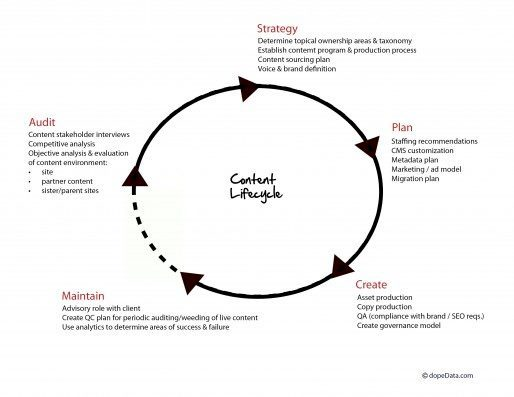
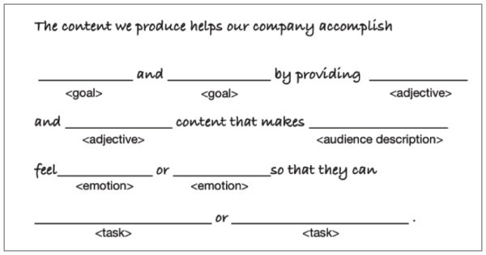
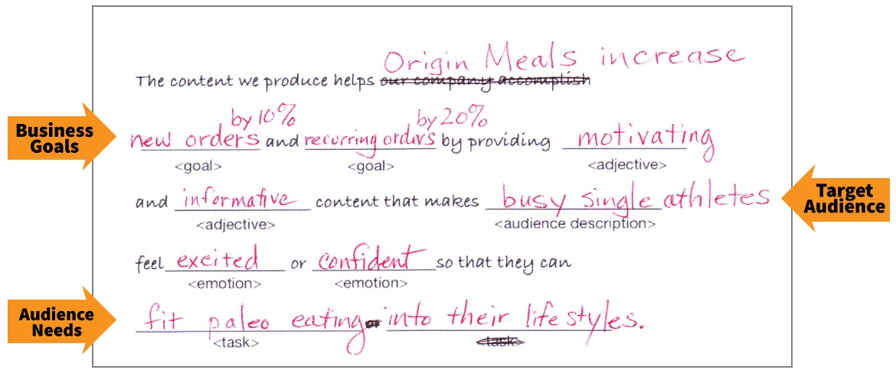
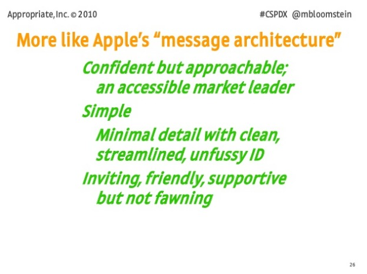
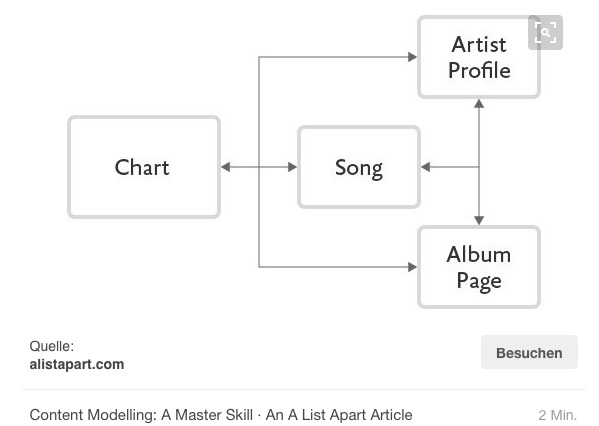
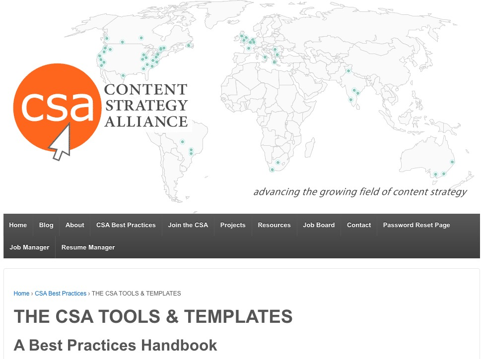
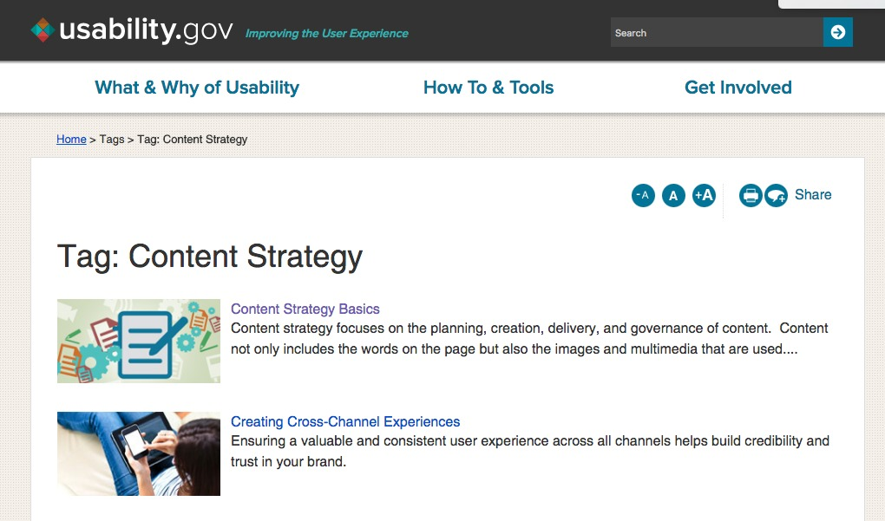

# Ziele

##

- Grundlagen der Disziplin der Content-Strategie verstehen
- Umsetzungsbedarf und -möglichkeiten in der eigenen Organisation erkennen

::: notes

Die TeilnehmerInnen sollen ihre Inhalte als eigenes Arbeitsthema entdecken. Es kommt darauf an, die Funktion der Inhalte im Zusammenhang mit Technik und Design zu verstehen. Die Voraussetzung dafür ist, dass man sich darüber klar wird, dass man heute immer auch eine digitale Organisation ist.

- Digitalisierung
- Inhalte über mehrere Touchpoints
- Digitale Umgebung

:::

# Ablauf

##

- 10:00 Begrüßung, Einleitung: Content-Strategie&mdash;The big picture
- 11:00 Customer Journey, Auditing: Content-Strategie als Service Design
- 11:45 Übung Personas und User Journey : Wie habe ich mich für diese Veranstaltung entschieden?
- 12:30 Pause
- 13:15 Übung Kernstrategie und Botschaftsarchitektur
- 14:00 Übung: Content-Typ, Template, Voice&Tone
- 14:30 Diskussion: Content und Change Management in meiner Organisation 

::: notes

Am Vormittag geht es im wesentlichen um Analyse, am Nachmittag um die Entwicklung eines Konzepts.

Wie nehmen als Beispiel - weil wir das alle kennen - den Inhalt des Steirischen Bildungsnetzwerks und das speziell diese Veranstaltung. Wir beschäftigen uns damit,
- welche Touchpoints es gibt,
- wie die User-Erfahrung aussieht,
- was die Ziele der User sind,
- was die Ziele des Bildungsnetzwerks sind (und wie sie mit den Zielen der User zusammenhängen),
- wie man eine Kernstrategie des Bildungsnetzwerkes definieren könnte,
- wie man eine Botschaftsarchitektur des Bildungsnetzwerks definieren könnte,
- wie man ein Content-Modell definieren kann,
- wie man Workflows und Monitoring festlegen könnte,
- wie die Governance aussehen könnte.

:::

# 1. Content-Strategie&mdash;Ein Überblick

##

[Content Strategy – the big picture](file:///home/heinz/github/slides-intro2contentstrategy/big-picture.html#/title-slide "Content Strategy – the big picture")

##

„Content strategy plans for the creation, delivery and governance of useful, usable content.“

## Content-Strategie als Disziplin

- Entwicklung seit den 1990er Jahren
- Vor allem in den USA und englischsprachigen Ländern
- In Digital Agenturen und großen Firmen
- Wurzeln in Redaktion, User Experience Design, Web Entwicklung und Marketing
- Basis für Content Marketing
- Professionalisierung in Europa beginnt

<!--

## Ziele heute:

- Content-Strategie als Disziplin darstellen
- Eigenständigkeit der Content-Strategie diskutieren

-->

## Wozu braucht man Content-Strategie?

Content-Strategie stellt sicher, dass ...
… Inhalte den Bedürfnissen ihrer Nutzer entsprechen
… Inhalte den Zielen der Auftraggeber entsprechen

## Publizieren ohne Content-Strategie ist wie Bauen ohne Planung

##

##

- Inhalte sind “Assets”:
- Inhalte zu erstellen ist mühsam, teuer und kompliziert
- Inhalte werden gepflegt und weiterentwickelt
- Inhalte lassen sich wiederverwenden

::: notes

Content- Artefakte mit einer Botschaft oder einen kommunikativen GehaltCS Planung dieser Artefakte in Bezug auf ihren Kommunikativen Gehalt

Eine Content-Strategie unterscheidet sich von einer Kommunikationsstrategie dadurch, dass sie sich vor allem mit den Artefakten beschäftigt, die on erster Linie existieren, um eilne kommunikative Botschaft vermitteln. Die Content-Strategie konzentriert sich auf die Artefakte und auf die besonderen Regeln die für diese Artefakte gelten. Sie tut dies aber nicht um diese Artefakte technisch zu produzieren sondern sie tut es mit dem Ziel dass die Artefakte die gewünschte Botschaft tatsächlich vermitteln Punkt auch in diesem Bereich ist die Content-Strategie mit der Architektur gut vergleichbar auch in der Architektur geht es nicht so einfach darum, Gebäude zu realisieren, die technisch funktionieren, also ihre Funktionen erfüllen, sondern darum, dass die Gebäude den Wünschen ihrer Benutzer und Auftraggeber optimal entsprechen.

Vom Konzept des Artefakts ausgehen kann man auch die Frage beantworten, ob ein Unterschied zwischen Content-Strategie überhaupt und digitaler Content-Strategie besteht. Content-Strategie braucht man für Inhalte, also Artefakte jeder Art Punkt alte bieten aber viel mehr Möglichkeiten, und die Artefakte zu denen sie gehören, sind wirklich komplexer als die Inhalte, die vor der digitalen Revolution gehabt, und die mit relativ überschaubaren Techniken produziert worden. Vor allem lassen sich digitale Inhalte leicht mit Ana ineinander überführen, sodass überhaupt erst Inhalte als solche ins Blickfeld geraten während man sich vorher eigentlich direkt mit den Artefakten Beschäftigte, also zB Büchern, an die diese Inhalte gebunden waren
:::

## Planung für den Lifecyle von Inhalten

##

Quelle: [Enterprise-Content-Management-in-SharePoint-Server](https://support.office.com/en-us/article/Introduction-to-Enterprise-Content-Management-in-SharePoint-Server-2007-67c13ac8-f6ef-4752-8976-d2910e1da6b4)

## Content-Strategie:

> wiederholbares System, welches das Management von Inhalten über den gesamten Lebenszyklus der Inhalte steuert

(Rahel Bailie, [Content Strategy Framework for the Content Lifecycle](https://de.slideshare.net/rahelab/content-strategy-framework-for-the-content-lifecycle "Content Strategy Framework for the Content Lifecycle"))

##

> Content strategy is to copywriting as information architecture is to design
(Rahel Lovinger)

Rahel Lovinger, [Content Strategy: The Philosophy of Data](http://boxesandarrows.com/content-strategy-the-philosophy-of-data/ "Content Strategy: The Philosophy of Data - Boxes and Arrows")

## Risiken ungeplanter Inhalte

- Mangelnde Konsistenz
- Erschwerte Wiederverwendbarkeit
- Verkennen der Potenziale von Inhalten
- Fehlende Benutzergerechtigkeit
- Schlechte Planung und Nutzung von Ressoucen
...

## Was tut ein Content-Stratege?

> ... a content strategist, working with, interfaces, systems, people, and the connections—and especially the disconnections—between them.”

::: notes

Wie Architekten müssen content Strategen mit einer großen Zahl ganz unterschiedliche Dinge Personen und Gegebenheiten arbeiten, um ein Ergebnis, nämlich Qualität von Inhalten, zu erreichen. Man kann sie nicht auf einem dieser verschiedenen Bereiche festlegen, auch wenn bei vielen Projekten der Hauptakzent auf einem dieser Bereiche liegt. Content hat mit der Verbindung sehr unterschiedliche Dinge zu tun, und diese Verbindungen sind das Hauptthema in der Arbeit von contact Strategen. Dieses Zitat von Jonathan Colman drückt diesem Zusammenhang, wie ich finde, sehr gut aus. Es zeigt auch dass das Hauptproblem bei der Arbeit vom content Strategen in fehlenden Verbindungen liegt, also  darin, Verbindungen herzustellen die notwendig sind. Da im Einzelfall in einer Organisation die Gegebenheiten sehr unterschiedlich sind natürlich auch die Verbindungen comedy ein Content-Strategie herstellen muss, sehr unterschiedlich. Sie hängen immer von der Organisation und den Zustand in dem sie sich befindet, ab.

## Content Strategy Quad

## {data-background="pics/Brain-Traffic-Content-Strategy-Quad-2018.png" data-background-size="contain"}

Braintraffic

## Zyklische Prozesse

Abb.: Erin Scime / DopeData.com, nach Ahava Leibtag</a>

::: notes

So, wie Inhalte selbst einen Lebenszyklus haben, so ist auch die Arbeit eines Inhalts Strategen Zugriff Punkt dabei ist Content nie abgeschlossen ist der Kreis der inhaltserstellung einmal durchlaufen, beginnt er in der Regel von 9 Punkt am Beginn steht immer eine Phase der Erhebung der Tatsachen, in dieser Abteilung Bildung hier als ordet bezeichnet. In dieser Phase versucht man sich über alles klar zu werden, was an Inhalten da ist und was für ein Projekt entscheidend sein kann. Erst nach dieser Phase kann tatsächlich eine Strategie definiert werden, und hier ist natürlich vor allem die Core Strategie gemeint, mit der wir uns eben schon beschäftigt haben. Wenn die strategiedefinition abgeschlossen ist, beginnt die Phase der konkreten Planung Punkt dieser Phase lassen sich die vier Bereiche des Content strategy Quad zuordnen, mit denen wir uns bereits beschäftigt haben Punkt wenn diese Phase abgeschlossen ist wird Inhalt erstellt. Die strategische arbeit im strengen Sinne ist dann abgeschlossen, auch wenn es in der Regel notwendig ist das Content Strategen die Arbeit der übrigens mit dem Inhalt Beschäftigten Leute begleiten. Die darauffolgende Phase wird in dieser Abbildung hier als maintenance, also als aufrechterhalten bezeichnet Punkt hier geht es darum das vorhandene System auf seine Umwelt, die sich ja wie das System selbst auch verändert abzustimmen Punkt es folgt dann wie Kontakt, in aller Regel ein neuer Zyklus der wieder mit einer Bestandsaufnahme beginnt ausgangspunkt dieser Phase und Ausgangspunkt bei jedem Projekt, das nicht das allererste strategische Projekt für Inhalte ist, sollte ein Monitoring des Umgangs mit dem vorhandenen Inhalten sein.

:::

## “The things we make” (Erin Kissane)
- Accessibility guidelines
- Benchmarks
- Channel strategy
- CMS requirements
- Communication plans
- Community and social strategy
- Community moderation policies
- Competitive analyses
- Content production workshops
- Content sourcing plans
- Content style guides
- Content templates
- Editorial calendars
- Example content
- Feature descriptions
- Gap analyses
- Metadata recommendations
- Project proposals
- Publishing workflow
- Qualitative content audit and findings
- Quantitative content audit and findings
- Resource review (people, tools, time)
- Search-engine optimization reviews
- Successmetrics
- Taxonomies
- Traffic analysis
- Usability tests
- User personas
- User research findings
- User research plans
- User scenarios
- Visual presentation recommendations
- Wireframes
- Work flow recommendations

::: notes

Content-Strategie produzieren bei ihrer Arbeit eine große Anzahl verschiedener deliverables. Es sind die Dokumente, in denen für nicht Content-Strategie fixiert wird, wie bei der Produktion der Inhalte vorzugehen ist Punkt was ein Content-Strategie macht, kann man gut darstellen, wenn man von diesen Dokumenten ausgeht. Das bedeutet aber nicht, dass die Arbeit eines konnten Strategen hauptsächlich in der Produktion von Dokumenten besteht diese Dokumente sind alle nur soviel wert, wie das Verständnis für ihre Inhalte in der Organisation, für die der Content-Strategie tätig ist es ist vielleicht ein bisschen wie beim Theater Doppelpunkt das Wesentliche ist nicht der Text so wichtig er auch ist und das Wesentliche ist auch nicht das Programm, das wesentliche ist die Aufführung selbst. wir haben ja schon zu Beginn gesehen, dass das dass das Arbeitsfeld eines konnten Strategen vor allem aus den Verbindungen von sehr unterschiedlichen Bestandteilen besteht Punkt dementsprechend kommt es auch in der Praxis der Content-Strategie und bei den Dokumenten vor allem auf die Beziehungen zwischen ihnen und zwischen den verschiedenen Menschen an, die mit diesen Dokumenten beziehungsweise ihren Inhalten umgehen Punkt die Prozesse die wir jetzt hier beschreiben, machen zusammen aus, wie die Voraussetzungen für gute Inhalte in einer Organisation geschaffen werden Punkt die Aufgabe des contentstrategie besteht darin wie ein Dirigent diese verschiedenen Komponenten zusammenzuführen Punkt ist also nicht der Instrumentalist, der eines dieser verschiedenen Tools gut beherrscht, sondern er ist derjenige der dafür sorgt dass die verschiedenen Instrumentalisten Fachleute auch die Instrumente selbst auch die Akustik des Raumes und die andere materiellen Voraussetzungen gut zusammenpassen.

:::

## Core Strategy

## {data-background="pics/bear.jpg" data-background-size="contain"}

##

- Fokus für Verbesserung von Substanz, Struktur, Workflow und Governance
- Klare Unterscheidung von dos und don’ts

## Content Audits

## {data-background="pics/audits.jpg" data-background-size="contain"}

## Content Assessments

## {data-background="pics/content-scorecard.jpg" data-background-size="contain"}

## User Research

## {data-background="pics/persona.jpg" data-background-size="contain"}

## Core Strategy Statement

Quelle: Meghan Casey, http://contentmarketinginstitute.com/2016/01/content-on-strategy-templates/

## Core Strategy Statement

Quelle: Meghan Casey, http://contentmarketinginstitute.com/2016/01/content-on-strategy-templates/

## Botschaftsarchitektur

##

## Voice and Tone

## Content Modelling

## Content Templates

## {data-background="pics/content-template.jpg" data-background-size="contain"}

## Workflow-Definition

## {data-background="pics/workflow-rockley.jpg" data-background-size="contain"}

## Rollendefinition und Governance

## {data-background="pics/governance.jpg" data-background-size="contain"}

http://de.slideshare.net/epublishmedia/planning-for-content-governance

## Tools und Deliverables: CSA

http://contentstrategyalliance.com/csa-best-practices/csa-handbook/

## Tools und Deliverables: CS Toolkit

http://thecontentstrategytoolkit.com/

Tools and Deliverables 3: usability.gov

http://www.usability.gov/tags/content-strategy/index.html

## Beispiele für Content-Strategie

> Dougherty-Wold developed a content strategy that included working on Graph Search's tools for refining and expanding searches, tips to help people use Graph Search's simple phrases,..

https://www.facebook.com/notes/facebook-design/the-people-behind-graph-search/10151210988497793/

http://www.huffingtonpost.com/2012/11/17/facebook-content-strategist_n_2150364.html

## Facebook: “Designing content for interfaces”

http://de.slideshare.net/doughertywold/manage-greenthumbfinal/93

## Digitas LBI

https://www.linkedin.com/title/content-strategist-at-digitaslbi

## cancer.org

http://de.slideshare.net/lisagdc/intelligent-content-a-case-study

## Harvard College

http://de.slideshare.net/Saraboettcher/all-together-now-content-collaboration-in-a-responsive-redesign

## Stadt Leoben

http://de.slideshare.net/coschu/moderne-verwaltungskommunikation-im-web

## Warum ist Content-Strategie wichtig?

##

“In the future, content, products and services will find you, rather than you having to find them.” [Dries Buytaert: The Big Reverse of the Web | Dries Buytaert]

## Benutzer kontrollieren die Zugänge zu den Inhalten

- Inhalt, mit dem die User nicht interagieren, findet nicht statt
- Algorithmen und Big Data privilegieren inhaltliche Qualität aus Nutzersicht
- Suche, Teilen und Abonnieren

## Ressourcen

Bücher
Abel, S., & Bailie, R. A. (2014). The Language of Content Strategy. XML Press.
Bailie, R. A., & Urbina, N. (2013). Content Strategy: Connecting the dots between business, brand and benefits. XML Press.
Bloomstein, M. (2012). Content strategy at work : real-world stories to strengthen every interactive project. Morgan Kaufmann.
Casey, M. (2015). The Content Strategy Toolkit: Methods, Guidelines, and Templates for Getting Content Right. New Riders.
Content Strategy Alliance (Hrsg.). (2015). Content Strategy Alliance Tools And Templates.
Cooper, C., & Rockley, A. (2012). Managing enterprise content : a unified content strategy. Berkeley: New Riders Publ.
Eck, K., & Eichmeier, D. (2014). Die Content-Revolution im Unternehmen. Freiburg im Breisgau: Haufe-Lexware.
Halvorson, K., & Rach, M. (2012). Content Strategy for the Web; second edition (Second). New Riders.
Kissane, E. (2011). The elements of content strategy. New York: A Book Apart.

Bücher
Löffler, M. (2013). Think Content! : Grundlagen und Strategien für erfolgreiches Content-Marketing. Galileo Press.
Mathewson, J., Donatone, F., & Fishel, C. (2010). Audience, Relevance, and Search: Targeting Web Audiences with Relevant Content (1 edition). IBM Press.
McGrane, K. (2012). Content strategy for mobile. New York: A Book Apart.
Nichols, K., & Rockley, A. (2015). Enterprise content strategy. XML Press.
Radl, B. A., & Wittenbrink, H. (2015). Content-Strategie. In Handbuch Online-PR. Strategische Kommunikation in Internet und Social Web (PR Praxis) (2., überarbeitete u. erweiterte Auflage, S. 127–140). UVK Verlagsgesellschaft.
Rockley, A., & Cooper, C. (2012). Managing Enterprise Content: A unified Content Strategy (2. Aufl.). New Riders.
Wachter-Boettcher, S. (2012). Content Everywhere: Strategy and Structure for Future-Ready Content. Brooklyn, New York: Rosenfeld Media.

## Websites:
The Epic List of Content Strategy Resources
A List Apart Articles about Content Strategy
The Language of Content Strategy
Content Strategy Resources
Content Strategy Conferences | Confab Events
CONTENT STRATEGY - Open Educational Resources

# 2. Content als Service&mdash;Was wollen unsere User?

## Content-Strategie = Service Design mit Inhalten

## Im Fokus:

End-to-end-Experiences

Touchpoints

Systeme

Inhaltsqualität

##

> Touchpoints represent fundamental building blocks in the journeys of customers as they interact with a product or service in multiple channels over time.

[Orchestrating Experiences - Rosenfeld Media](https://rosenfeldmedia.com/books/orchestrating-experiences/)

##  {data-background="https://farm1.staticflickr.com/863/39867380770_f9afb0d39c_h.jpg" data-background-size="contain"}

Quelle: Risdon, Quattlebaum,
[Rosenfeldmedia](https://www.flickr.com/photos/rosenfeldmedia/39867380770/in/album-72157668191892598/).[CC BY-SA 2.0](https://creativecommons.org/licenses/by-sa/2.0/)

##

>  Wie designen wir Service-Erfahrungen, die unsere flüssigen Erwartungen erfüllen
>
>... und alle diese Systeme integrieren
>
>... über alle diese Touchpoints
>
>... ohne noch mehr mittelmäßige Inhalt zu verlangen?

[Jennifer McCutchen](https://de.slideshare.net/jennicolem/content-strategy-in-service-design/15)

## Beispiel gov.uk

## Service-orientiertes Angebot

## {data-background="pics/gov_uk_homepage.png" data-background-size="contain"}

Quelle Screenshot: [Welcome to GOV.UK](https://www.gov.uk/)

##

> To a user, a service is simple. It’s something that helps them to do something - like learn to drive, buy a house, or become a childminder.

Quelle: [What we mean by service design - Government Digital Service](https://gds.blog.gov.uk/2016/04/18/what-we-mean-by-service-design/)

---

> Government services are sometimes split into tiny pieces: lots of isolated transactions, products, and content provided by different parts of government that need to be used together by a user to achieve their goal.

Quelle: [What we mean by service design - Government Digital Service](https://gds.blog.gov.uk/2016/04/18/what-we-mean-by-service-design/)

---

> Service design is the activity of working out which of these pieces need to fit together,asking how well they meet user needs, and rebuilding them from the ground up so that they do.

Quelle: [What we mean by service design - Government Digital Service](https://gds.blog.gov.uk/2016/04/18/what-we-mean-by-service-design/)

## {data-background="pics/lars_bostrom.jpg" data-background-size="contain"}

## Digital by default

Quelle: [A year in the making - the Digital by Default Service Standard - Government Digital Service](https://gds.blog.gov.uk/2014/04/01/a-year-in-the-making-the-digital-by-default-service-standard/)

## {data-background="pics/were_in_the_business.jpg" data-background-size="contain"}

## {data-background="pics/improving_user_satisfaction.jpg" data-background-size="contain"}

## Start with user needs

[Service Manual - GOV.UK](https://www.gov.uk/service-manual)

Quelle: [User needs and revolutions - Government Digital Service](https://gds.blog.gov.uk/2014/04/23/user-needs-and-revolutions/) Rechte: [Open Government Licence](https://www.nationalarchives.gov.uk/doc/open-government-licence/version/3/)

[Agile delivery - Service Manual - GOV.UK](https://www.gov.uk/service-manual/agile-delivery)

## Laufendes Feedback

## {data-background="pics/currently_on_govuk.jpg" data-background-size="contain"}

## Agile Arbeitsweise

## {data-background="pics/core_of_kanban.jpg" data-background-size="contain"}

## {data-background="pics/postit_board.jpg" data-background-size="contain"}

## Agile Arbeitsweise in großen Teams

## {data-background="pics/gov_uk_content.jpg" data-background-size="contain"}

## {data-background="pics/kanban_kanban.jpg" data-background-size="contain"}

## Laufende interne Verbesserung

## {data-background="pics/govuk_improvement.jpg" data-background-size="contain"}

## Transparenz

## {data-background="pics/blogs_govuk.png" data-background-size="cover"}

## Service Design

## Was ist Service Design?

> Die Planung und Organisation von Menschen, Infrastruktur, Kommunikation und Touchpoints, die erforderlich ist, um erfolgreiche Services zu ermöglichen. Sie stellt sich strategisch der Komplexität heutiger Multi-Touchpoints in einer Sprache menschlicher Erfahrungen.

[[Service Design is](https://de.slideshare.net/jennicolem/content-strategy-in-service-design/25)]

##  Service Design Done Well

> “Wenn zwei Kaffeehäuser direkt nebeneinander geöffnet sind, und jedes von ihnen genau denselben Kaffee zum genau gleichen Preis anbietet, entscheidet das Service-Design, ob du in das eine und nicht in das andere gehst.”

[SERVICE DESIGN DONE WELL](https://de.slideshare.net/jennicolem/content-strategy-in-service-design/28)

---

## {data-background="https://farm1.staticflickr.com/870/41634489422_ecb15fedf4_h.jpg" data-background-size="contain"}

Quelle: Risdon, Quattlebaum,
[Rosenfeldmedia](https://www.flickr.com/photos/rosenfeldmedia/27805555498/in/album-72157668191892598/).[Creative Commons — Attribution-ShareAlike 2.0 Generic — CC BY-SA 2.0](https://creativecommons.org/licenses/by-sa/2.0/)

## Service Blueprints

## {data-background="pics/brandon_schauer_service_blueprint.png" data-background-size="contain"}

Quelle: Brandon Schauer, Adaptive Path [Service blueprint for Service Design panel | You can view it… | Flickr](https://www.flickr.com/photos/brandonschauer/3363169836/).[Creative Commons — Attribution-ShareAlike 2.0 Generic — CC BY-SA 2.0](https://creativecommons.org/licenses/by-sa/2.0/)

##

> Use the service blueprint as a space in which different scenarios can be played out. The blueprint should show the essential parts of the service ecology so that you can track different user journeys through it in a number of “What if?” scenarios.

Andy Polaine, Ben Reason & Lavrans Løvlie: [Service Design: Chapter 6: Developing the Service Proposition :: UXmatters](https://www.uxmatters.com/mt/archives/2013/03/service-design-chapter-6-developing-the-service-proposition.php)

## {data-background="pics/service_design_blueprint.jpg" data-background-size="contain"}

[Creative Commons — Attribution 2.0 Generic — CC BY 2.0](https://creativecommons.org/licenses/by/2.0/), Quelle: [→](https://www.flickr.com/photos/rosenfeldmedia/8461139713/in/photostream/)

## Experience Maps

## {data-background="https://farm1.staticflickr.com/959/39867374570_240d8cf3dc_h.jpg" data-background-size="contain"}

Quelle: Risdon, Quattlebaum,
[Rosenfeldmedia](https://www.flickr.com/photos/rosenfeldmedia/39867374570/in/album-72157668191892598/).[Creative Commons — Attribution-ShareAlike 2.0 Generic — CC BY-SA 2.0](https://creativecommons.org/licenses/by-sa/2.0/)

## Service Design Basics

- Strikte User-Orientierung
- Mehrere Touchpoints
- Holistischer Ansatz - Zusammenwirken verschiedener Komponenten
- Frontend- und Backend-Design

## Content-Strategie ist Service-Design mit Inhalten

- Content ist ein eigenes Layer
- Er ist unabhängig von bestimmten Touchpoints
- Content ist immer Bestandteil eines Service
- Frontent- und Backend-Strategie wirken zusammen
- Service-Design ist *digital native*, aber nicht *digital only*

## Anatomie eines Service

> 1. Services leben durch Menschen, aber sie hängen von einem komplexen Gewebe von Backstage-Systemem und -Prozessen ab.
> 2. Menschen interagieren über Touchpoints mit einem Service. Die Menge aller dieser Touchpoints bildet eine Service-Erfahrung.
> 3. Wie der Service erfahren wird, bestimmt unmittelbar die Wahrnehmung der Marke.

[Content Strategy in Service Design](https://de.slideshare.net/jennicolem/content-strategy-in-service-design/30)

## CONTENT WITHIN A SERVICE

> Inhalt wird von Menschen geschaffen und verwendet. Aber er wird durch dasselbe komplexe Gewebe von Backstage-Systemem und -Prozessen gemanagt. Inhalt wird über Touchpoints wahrgenommen.

[Content Strategy in Service Design](https://de.slideshare.net/jennicolem/content-strategy-in-service-design/30)

---

> Ein Stück Inhalt kann an nur einem Touchpoint vorhanden sein, oder es kann sich zwischen Touchpoints bewegen. Die Menge aller dieser Inhalte über alle Touchpoints bildet eine Inhaltserfahrung.

[Content Strategy in Service Design](https://de.slideshare.net/jennicolem/content-strategy-in-service-design/30)

---

> Wie gut der Inhalt über das ganze Ökosystem hinweg funktioniert - oder nicht funktioniert - beeinflusst die Qualität der Service-Erfahrung. Wie der Inhalt wahrgenommen wird, bestimmt direkt die Wahrnehmung der Marken.

[Content Strategy in Service Design](https://de.slideshare.net/jennicolem/content-strategy-in-service-design/30)

##

- Inhalte ermöglichen, erklären und vereinfachen Dienste
- Inhalt macht die Erfahrung von Diensten einheitlich und ganzheitlich

## Entwurfsprozess

Discover - Define- Develop - Deliver

## { data-background="pics/double_diamond1.png" data-background-size="contain" }

## { data-background="pics/double_diamond2.png" data-background-size="contain" }

## Design-Werkzeuge

## Szenarios describe the actor's contexts

> **Activity** What do they want to do? **Space** Where are they doing it? **Time** When is this all happening? **Personal** What's their emotional state and needs? **Channel** Which devices or platforms are used?

(Inspired by Cenny D D Bowles - Designing with context)

(Mike Atherton: [Customer Service Design: Content Strategy in the Spaces Between](https://www.slideshare.net/reduxd/designing-customer-service-content-strategy-in-the-spaces-between))

## Empathy Maps

## { data-background="pics/Empathy_Map_Template.png" data-background-size="contain" }

[Empathy Mapping: grok your users | Atlassian Team Playbook](https://www.atlassian.com/team-playbook/plays/empathy-mapping)

## Directed Storytelling

> 1. Assign 1 person in your group to be “storyteller” and 1 person to be the “interviewer.”
>
> 2. STORYTELLer: Describe the process... Walk through every step in excruciating detail.*
>
> 3. INTERVIEWER: Ask the storyteller open-ended questions about the process.
>
> 4. NOTETAKERS: Using Post-its, document the details from the story. Keep it to 1 idea per Post-It.

[DIRECTED STORYTELLING (5 MIN.)](https://de.slideshare.net/jennicolem/content-strategy-in-service-design/73)

## Affinity Diagram

> 1. One by one, combine each notetaker’s Post-its into one diagram, grouping similar ideas together.
>
> 2. Collaborate as group to agree on clusters and then name the clusters.
>
> 3. Vote on the top three themes from the clusters that could differentiate the service experience if it was reimagined.

[AFFINITY DIAGRAM (5 MIN.)](https://de.slideshare.net/jennicolem/content-strategy-in-service-design/74)

## Customer Journey Mapping

> 1. Using the documented research as guidance, identify each stage of the user journey.
>
> 2. Identify the user’s actions, touchpoints, thoughts/emotions...
>
> 3. Identify the frontstage content elements -- content needs, content types and formats, channels and key messages.
>
> 4. IF TIME PERMITS: Focus on one or two areas of opportunity that would improve the experience.

[UNDERSTAND THE USER JOURNEY (15 MIN)](https://de.slideshare.net/jennicolem/content-strategy-in-service-design/75)

## Contentstrategie und Content-Marketing

## Outside-in statt Inside-out-Marketing

> “You listen for the needs of your clients and you build messages that serve those needs, on and in their terms,” said Mathewson, a distinguished technical marketer for search at IBM. “Then you place these messages in convenient places in their buyer journeys – typically search and social media settings.

---

> The messages attract them to your owned content marketing properties, where you can more deeply engage them, and ultimately convert them into loyal clients. This engagement initially takes the form of conditioning the conversation towards your brands and differentiating propositions, but ends in a strong relationship built on trust.”

[B2B Best Practices: Content marketing with James Mathewson & Mike Moran - B2B News Network](https://www.b2bnn.com/2016/05/b2b-best-practices-content-marketing-with-james-mathewson-mike-moran/)

## Marketing und Discovery

- Durch Inhalte werden Services entdeckbar
- Durch Inhalte werden Services verbreitet
- Inhalte zur Außenkommunikation bauen auf Inhalten als Komponenten eines Service auf
- Durch Inhalte werden Services verständlich

## Beispiel: Weiterbildungsveranstaltung des Bildungsnetzwerks

## Übung: Wie habe ich mich für diese Veranstaltung entschieden?

## Übung: Wer sind meine User und was wollen sie?

## Übung: Touchpoint-Verzeichnis

Persona, Empathy Map, Customer Journey

::: notes

Es kommt darauf an zu verstehen, welche Touchpoints bei der Kommunikation mit dem Bildungsnetzwerk eine Rolle spielen. Einerseits kommt es darauf an, dass diese Touchpoints aufeinander abgestimmt sein sollten. Andererseits sind dazu Prozesse im Backend nötig. Auf der Frontend-Seite sollte der Inhalt einheitlich sein und zu den verschiedenen Touchpoints passen. Auf der Backend-Seite muss dafür gesorgt werden, dass jeweils der richtige Inhalte zur richtigen Zeit die richtigen User erreicht.

:::

## User Research, Analytics, Monitoring

## Content Audits

# 3. Kernstrategie, Botschaftsarchitektur: Wer sind wir? Was wollen wir erreichen?

## Wer sind die Stakeholder?

## Kernstrategie

## Ergebnis: Kernstrategie-Statement

## Botschaftsarchitektur

## Ergebnis: Kernbotschaften

::: notes

Ich muss wissen, mit wem ich spreche und was ich von einer Institution erwarten kann. Das ist der Kern der Markenbotschaften. Umgekehrt muss ich den Usern eindeutig vermitteln, wer ich bin, was sie von mir erwarten und warum sie mir glauben können.

Meine Botschaften sind aber eingebunden in einen praktischen Zweck. Die User wollen etwas. In unserem Fall brauchen sie wahrscheinlich Unterstützung bei der Organisation ihrer eigenen Online-Kommunikation

:::

# 4. Modelle und Plattformen

## Übung: Welchen Content wollen meine User an welcher Stelle?

- Website
- Newsletter
- Social Media
- Nachbereitung

::: notes

Hier ist wichtig, auf Content Marketing einzugehen.

:::

## Wie sollten die Formate aussehen?

## Übung: Design Veranstaltungsinformation

# 5. Backend und Content Operations

# 6. Governance und Change Management

## Wie geht meine Organisation mit Inhalten um?

- Übung: Gemeinsame Probleme identifizieren

## Welchen Veränderungsbedarf gibt es?

# Output

## Content-Strategie-Dokument

- Wer sind meine User? Persona/Empathy Map
- Was will ich erreichen - Kern-Strategie-Statement
- Wie trete ich auf? Kernbotschaften
- Wie ist der Ist-Zustand? Audit Ankündigung
- Welche Content-Formate verwende ich? Wie sieht die Veranstaltungsbeschreibung aus und mit welchen anderen Inhalten ist sie verbunden?
- Wie sieht der Workflow für meinen Content aus? Wie produziere ich die Information? Was kann ich wiedernutzen? Wie messe ich den Erfolg?
- Was muss ich verändern? Welche Schritte kann ich in meiner Organisation umsetzen?
